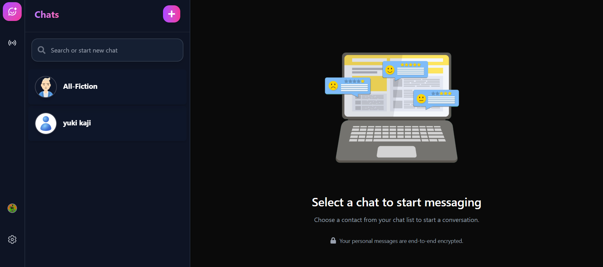

# ZingItChat 🚀

[](https://reactjs.org/)
[](https://nodejs.org/)
[](https://socket.io/)
[](https://tailwindcss.com/)
[](https://www.mongodb.com/)

A modern, real-time chat application with video calling, status updates, and a sleek glassmorphism UI. Built with React, Node.js, Socket.IO, and more!

 <!-- Replace with actual screenshot -->

## ✨ Features

- **Real-time Messaging**: Instant chat with optimistic UI and message deduplication
- **Video Calling**: Integrated video calls using WebRTC and Twilio
- **Status Updates**: Share and view statuses with live viewer counts
- **Modern UI**: Glassmorphism design with animations powered by Framer Motion
- **Responsive Design**: Works seamlessly on desktop and mobile
- **Authentication**: Secure JWT-based login and user management
- **File Uploads**: Cloudinary integration for image uploads
- **Themes**: Light and dark mode support

## 🛠️ Tech Stack

### Frontend

- **React** - UI library
- **Vite** - Build tool and dev server
- **Tailwind CSS** - Utility-first CSS framework
- **Framer Motion** - Animation library
- **Zustand** - State management
- **Socket.IO Client** - Real-time communication
- **React Icons** - Icon library
- **Emoji Picker** - Emoji selection
- **Date-fns** - Date formatting

### Backend

- **Node.js** - Runtime environment
- **Express.js** - Web framework
- **MongoDB** - NoSQL database
- **Mongoose** - ODM for MongoDB
- **Socket.IO** - Real-time bidirectional communication
- **JWT** - Authentication
- **Multer** - File upload handling
- **Cloudinary** - Cloud storage for images
- **Twilio** - Video calling service
- **Nodemailer** - Email service

## 📋 Prerequisites

Before you begin, ensure you have the following installed:

- **Node.js** (v18 or higher) - [Download here](https://nodejs.org/)
- **npm** or **yarn** - Comes with Node.js
- **MongoDB** - Local installation or cloud (e.g., MongoDB Atlas)
- **Git** - For version control

You'll also need accounts for:

- **Cloudinary** - For image uploads
- **Twilio** - For video calling (optional)

## 🚀 Installation & Setup

Follow these steps to set up ZingItChat from scratch:

### 1. Clone the Repository

```bash
git clone https://github.com/SR22kl/zingItChat.git
cd zingitchat
```

### 2. Set Up the Backend (Server)

Navigate to the server directory and install dependencies:

```bash
cd server
npm install
```

Create a `.env` file in the `server` directory with the following variables:

```env
PORT=5000
MONGO_URI=mongodb://localhost:27017/zingitchat  # Or your MongoDB Atlas URI
JWT_SECRET=your-super-secret-jwt-key
CLOUDINARY_CLOUD_NAME=your-cloudinary-cloud-name
CLOUDINARY_API_KEY=your-cloudinary-api-key
CLOUDINARY_API_SECRET=your-cloudinary-api-secret
TWILIO_ACCOUNT_SID=your-twilio-account-sid  # Optional for video calls
TWILIO_AUTH_TOKEN=your-twilio-auth-token
TWILIO_API_KEY=your-twilio-api-key
EMAIL_USER=your-email@gmail.com  # For OTP emails
EMAIL_PASS=your-email-password
```

Start MongoDB if running locally:

```bash
mongod  # On Windows, or use MongoDB Compass
```

Run the server:

```bash
npm start
```

The server will start on `http://localhost:5000`.

### 3. Set Up the Frontend (Client)

Open a new terminal and navigate to the client directory:

```bash
cd ../client
npm install
```

Create a `.env` file in the `client` directory:

```env
VITE_API_URL=http://localhost:5000
VITE_SOCKET_URL=http://localhost:5000
```

Run the client:

```bash
npm run dev
```

The client will start on `http://localhost:5173` (Vite's default port).

### 4. Build for Production

To build the client for production:

```bash
cd client
npm run build
```

Serve the built files:

```bash
npm run preview
```

For the server, deploy to a platform like Render or Heroku that supports WebSockets.

## 🎯 Usage

1. **Register/Login**: Create an account or log in with existing credentials.
2. **Start Chatting**: Select a contact from the sidebar and send messages.
3. **Video Calls**: Click the video call button to initiate a call.
4. **Status Updates**: View and post statuses in the status section.
5. **Themes**: Toggle between light and dark modes in settings.

## 📁 Project Structure

```
zingitchat/
├── client/                 # React frontend
│   ├── public/
│   ├── src/
│   │   ├── components/     # Reusable UI components
│   │   ├── pages/          # Page components
│   │   ├── services/       # API and socket services
│   │   ├── store/          # Zustand stores
│   │   └── utils/          # Utility functions
│   ├── package.json
│   └── vite.config.js
├── server/                 # Node.js backend
│   ├── config/             # Database and cloud configs
│   ├── controllers/        # Route handlers
│   ├── middleware/         # Auth and error handling
│   ├── models/             # Mongoose schemas
│   ├── routes/             # API routes
│   ├── service/            # External services (Socket, Email, etc.)
│   └── index.js            # Server entry point
└── README.md
```

## 📞 Contact

- **Author**: Sumit Rathod
- **Email**: sbrathod22kl@gmail.com
- **GitHub**: [SR22kl](https://github.com/SR22kl)

---

Made with using React, Node.js, and Socket.IO</content>
<parameter name="filePath">d:\W-FSD\zingItChat\README.md
